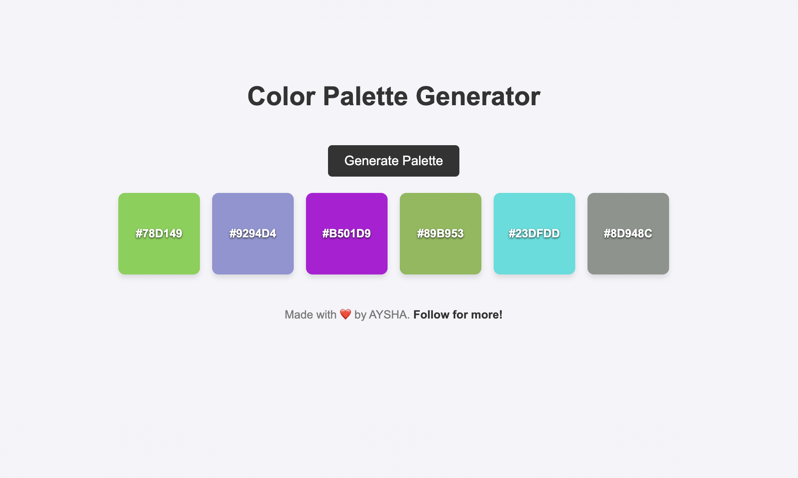

# Day 5: Color Palette Generator

## Project Overview
On Day 5, we created a **Color Palette Generator** using **HTML**, **CSS**, and **JavaScript**. This project allows users to generate random color palettes and copy color codes with a single click. It's an interactive and visually appealing tool that demonstrates the power of JavaScript in building dynamic web applications.

---

## Features
1. **Random Color Generation**:
   - Generates six random colors every time the user clicks the "Generate Palette" button.

2. **Copy to Clipboard**:
   - Users can click on any color box to copy its hex code to the clipboard.

3. **Interactive Design**:
   - Includes hover effects and smooth animations for an engaging user experience.

4. **Responsive Layout**:
   - Works seamlessly on various screen sizes, including desktops, tablets, and mobile devices.

---
# Demo page
Click [Here](https://ayshasanyang.github.io/Day5-Color-Palette-Generator/) to view the page
---

## 🚀 How to Run
1. Download or clone the repository
```bash
git clone https://github.com/ayshasanyang/Day5-Color-Palette-Generator.git
```
2. Navigate to the project folder.
3. Open the project files in your vscode or any code editor of your choice
4. Open the `index.html` file in your web browser.
---
## 🛠️ Technologies Used
- **HTML** for structure
- **CSS** for styling and animations
- **JavaScript** for interactivity

### 📸 Preview
  
---

## 📢 Connect
If you enjoyed this project, let me know! Follow me on social media to see more coding content:
- Instagram: [@codewithaysha](#)
- TikTok: [@Aysha](#)

---
